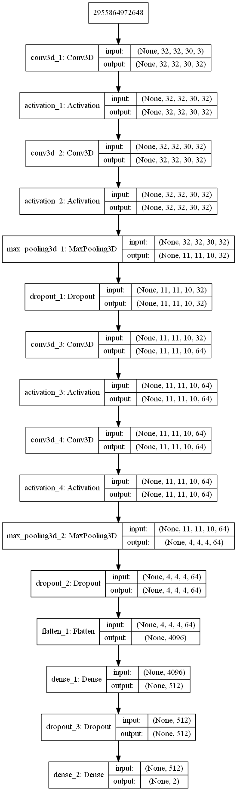
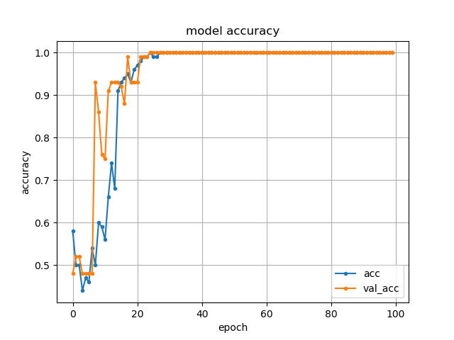
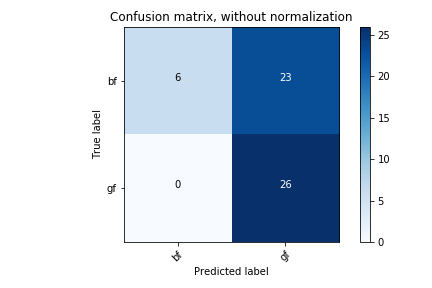
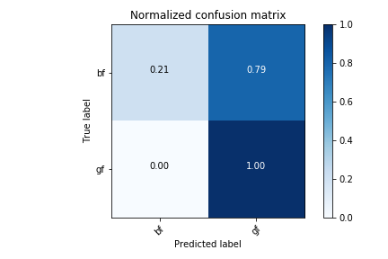
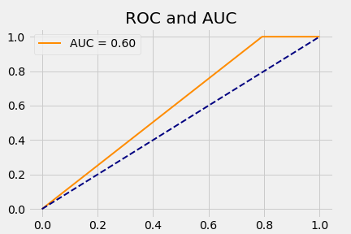
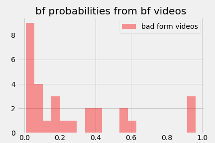
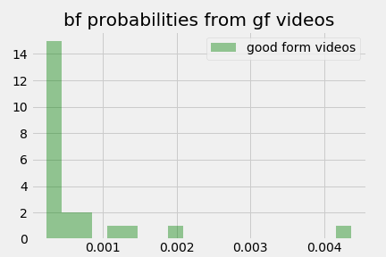
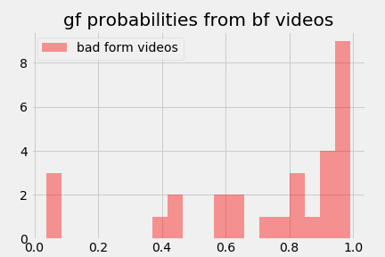
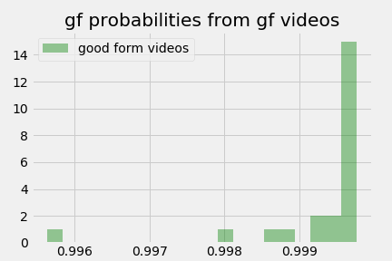

# **Evaluating squat performance using deep learning and computer vision**

## 1. Introduction

### 1.1 About this work

This repository contains the necessary files and instructions to recreate my captsone project that I did for the Data Science Full-Time program at BrainStation (Toronto). 

The point of this project was to use computer vision and deep learning to evaluate squate performance. Aka - can a model detect whether a video contains a good form squat or a bad form squat.

### 1.2 Project blurb
The fields of physical rehabilitation, physiotherapy and athletic coaching can intersect at a common technique: functional movement screening. This project aims to automate the screening process for one exercise using neural networks. The target will be to evaluate squat performance from a video. The squat is an total-body compound movement which has great utility in our every day lives and sports.

### 1.3 Project overview
    1. Created 10 bad form squat videos and 10 good form squat videos, each about 2-3 seconds, at 
    1080p and 60 fps (example below):

    2. Used photoshop to add noise and distort the original 20 videos to create 200 videos. The videos
    were then titled gf_x.mp4 or bf_x.mp4 where gf/bf are the good/bad form labels (examples below):

    3. Fed these videos into the support neural network to create a dataset that contained only the essential 
    information (example of output below):

    4. Used the pose estimation videos to train the main neural network (network architecutre pictured below):

    5. Compared the predictions of the model with the true labels.

## 2. Getting Started

### 2.1 Python packages required

- keras
- tensorflow
- opencv
- scikit-learn
- pydot
- graphviz
- pillow
- matplotlib
- seaborn
- pandas
- numpy
- jupyter
- jupyter lab

### 2.2 Pretrained weights for model used in pose estimation

    1. Download the file from: https://www.dropbox.com/s/llpxd14is7gyj0z/model.h5
    2. Make sure this file is in the main directory (where the .py scripts are).

### 2.3 Configuring a computer on google cloud (optional)

To be added

## 3. Using the models

### 3.1 Obtain squat videos

Obtain footage of someone performing a squat from the side.

### 3.2 Transforming videos into pose estimation versions

Arguments accepted for the support model:
- --videos *directory containing videos* 
- --output *directory for output*

You can use the following command to transform your squat videos into pose estimation squat videos:
- python demo_video.py --videos *directory containing videos* --output *directory for output*

### 3.3 Training the prediction model

Arguments accepted for the main model:
- --batch *size that the model will use to parse through the data*
- --epoch *number of model iterations*
- --videos *directory containing pose estimation videos* 
- --output *directory for output* 
- --nclass *number of classes* 
- --color *use color or not* 
- --skip *skip frames or use all available* 
- --depth *number of frames to use*

You can use the following command to train the main model:
- python 3dcnn.py --batch 128 --epoch 100 --videos (directory containing pose estimation videos) --output (directory for output) --nclass 2 --color True --skip False --depth 30

### 3.3 Evaluating the model

Executing the squatpredictions notebook.

## 4. My conclusions

### 4.1 Model learned quickly

Despite only using 55 videos to train the main model, the model was able to learn the patterns fast:

### 4.2 Predictions are better than the baseline but aren't great

The model does have a tendency to overpredict the good form probabilities for each video submitted

### 4.3 Probability distribution insights

Probabilities generated for good form videos are much less varied than the probabilites generated for bad form videos.
This means that the model can pick up on the characteristics of a good form versus a bad form.

# Authors

    Davis Ly - Initial work - BrainStation
    
# References
1. Fujimoto Lab, Kobe City College of Technology: 3D convolutional neural network for video classification. https://github.com/kcct-fujimotolab/3DCNN

2. Faber, M.: Keras version of Realtime Multi-Person Pose Estimation project. https://github.com/michalfaber/keras_Realtime_Multi-Person_Pose_Estimation

# License

This project is licensed under the MIT License - see the LICENSE.md file for details
